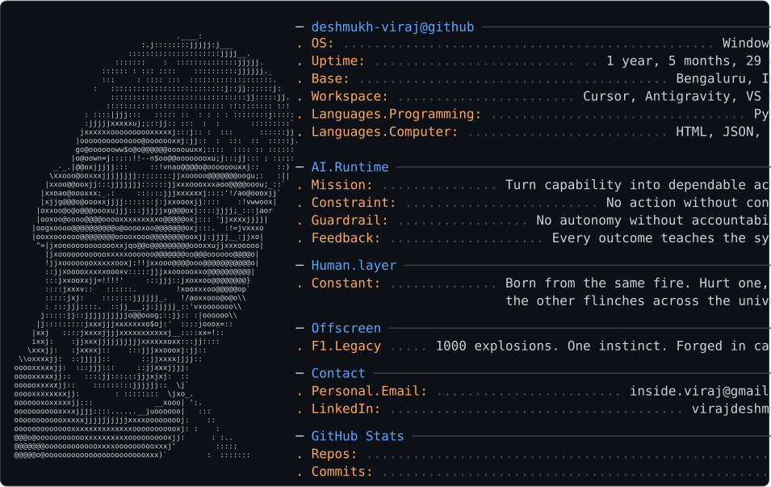

  <picture>
    <source
      media="(prefers-color-scheme: dark )"
      srcset="dark_mode.svg"
    />
    <source
      media="(prefers-color-scheme: light)"
      srcset="light_mode.svg"
    />
    
  </picture>

<h1 align="center">VIRAJ DESHMUKH</h1>

  AI/ML Engineer focused on turning emerging capabilities into dependable systems

<pre align="center">
 QKᵀ / √dₖ → softmax → V
</pre>

  
  &nbsp;&nbsp;
  
  &nbsp;&nbsp;
  

## Engineering the Intelligence Layer:

I engineer AI systems as systems, not prompts. I work on the layer where model capabilities become useful: coordinating context, reasoning, tools, and actions into intelligent workflows that can operate inside real products.

My interest lies in the architecture around AI: how components communicate, how models are orchestrated, how AI applications interact with external tools and services, and how intelligent behavior can remain observable, controllable, and useful beyond a prototype.

The model is only one component of the product. The real engineering is in the interfaces, the orchestration, the data flow, the inference path, and the trade-offs between capability, latency, cost, reliability, and human control.

Models, frameworks, and integration patterns will continue to change. That is not a blind spot—it is the nature of the field. I build on durable principles:
clear system boundaries, well-defined contracts, measurable behavior, and the ability to learn and integrate what comes next.

## 🌐 Socials:
   

# 💻 Tech Stack:
                       

# 📊 GitHub Stats:
 
 

## 🏆 GitHub Trophies

### ✍️ Random Dev Quote

---

<!-- Proudly created with GPRM ( https://gprm.itsvg.in ) -->
<!-- Proudly created with GPRM ( https://gprm.itsvg.in ) -->
